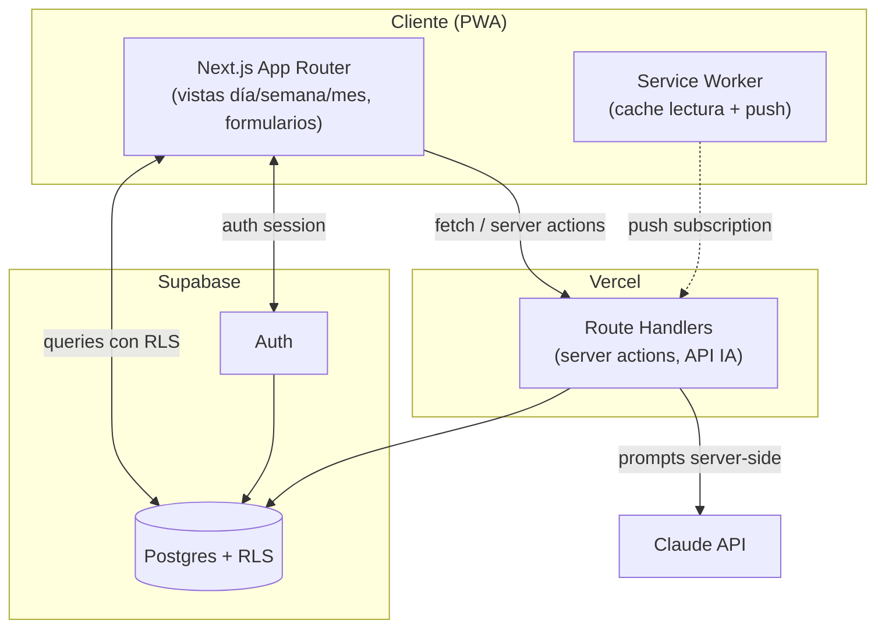
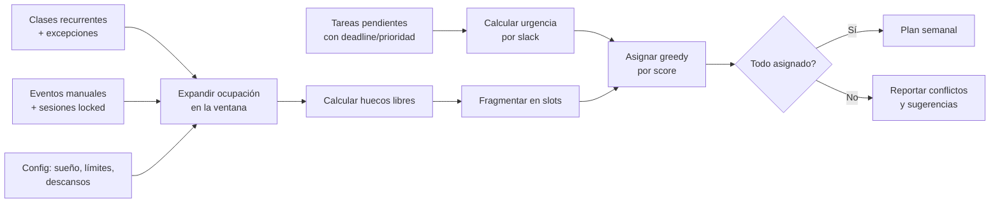

# Arquitectura

## 1. Alternativas evaluadas

| Criterio | A. Next.js PWA + Supabase | B. Next.js PWA + backend propio (Nest/Fastify) | C. Expo (RN + web) + Supabase |
|---|---|---|---|
| Esfuerzo a 5-8 h/sem | Bajo — un solo runtime, RLS ya resuelve autorización | Alto — hay que escribir y mantener API, auth, autorización a mano | Alto — dos plataformas de build, RN Web tiene fricción de estilos |
| Costo | $0 (Vercel + Supabase free tier) | $0 (Vercel + Render/Fly free tier) + más ops | $0 web, $99-125/año si se publica en stores |
| "Enlace para el CV" | ✅ URL directa | ✅ URL directa | ⚠️ la versión web de Expo es secundaria, no la experiencia principal |
| Escalabilidad | Buena — Postgres real, RLS, límites conocidos del free tier | Buena, pero la escalabilidad es 100% responsabilidad propia | Buena en backend, complejidad extra en frontend |
| Valor de portafolio | Alto — demuestra modelado de datos, RLS, algoritmo propio | Alto en backend, pero gran parte del tiempo se va en boilerplate de auth | Alto pero disperso entre dos plataformas, menos profundidad en cada una |
| Riesgo de abandono | Bajo | Medio-alto (mucho por construir antes de tener algo usable) | Alto (dos runtimes que mantener en 5-8 h/sem) |

## 2. Recomendación: **A — Next.js 15 (App Router) como PWA + Supabase**

### Por qué no B (backend propio)

Un backend propio duplica esfuerzo para resolver algo que Postgres ya resuelve mejor: Row Level
Security es autorización a nivel de base de datos, verificable con una prueba directa (usuario B
consulta datos de A, recibe vacío), no un `if` disperso en controladores que hay que auditar a mano.
Para un solo desarrollador con 5-8 h/semana, ese tiempo rinde más en el algoritmo del planificador
(la pieza diferencial del proyecto) que en reimplementar auth y CRUD.

Ver [`decisions/0002-supabase-vs-backend-propio.md`](decisions/0002-supabase-vs-backend-propio.md).

### Por qué no C (Expo / React Native)

El requisito explícito es *"un enlace que pueda poner en mi CV"*. Una app nativa no es un enlace.
Expo + RN Web sí genera una versión web, pero es una plataforma secundaria dentro de un proyecto
pensado primero para nativo — más configuración, más superficie de bugs de estilos entre entornos,
y el único beneficio real (push notifications más pulido en iOS) no compensa duplicar el esfuerzo de
build en un proyecto de un solo desarrollador con tiempo acotado. Una PWA instalable cubre "app en el
celular" sin ese costo.

Ver [`decisions/0001-pwa-vs-native.md`](decisions/0001-pwa-vs-native.md).

## 3. Stack elegido

- **Frontend**: Next.js 15 (App Router), TypeScript, Tailwind CSS, shadcn/ui. Mobile-first.
- **PWA**: manifest + service worker (cache de solo lectura), instalable en Android/iOS 16.4+.
- **Backend**: Supabase — Postgres, Auth (email + Google OAuth), Row Level Security, Storage si hace falta.
- **IA**: Claude API llamada server-side (Route Handlers de Next.js), nunca expuesta al cliente.
- **Notificaciones**: Web Push API (VAPID) + tabla de suscripciones en Supabase.
- **Hosting**: Vercel (free tier), despliegue automático desde `main`.
- **Pruebas**: Vitest (unitarias, especialmente el scheduler) + Playwright (e2e).
- **CI**: GitHub Actions — lint, typecheck, test, build en cada PR.

## 4. Diagrama de componentes

## 5. Diagrama de flujo del planificador

## 6. Límites del free tier a vigilar

- Supabase free: 500 MB DB, proyecto se pausa tras 7 días de inactividad (aceptable para uso personal
  activo; se documenta como riesgo conocido).
- Vercel free: suficiente para tráfico personal/portafolio.
- Claude API: uso mínimo por diseño (2 funciones puntuales), con rate limit propio para evitar sorpresas
  de costo.
