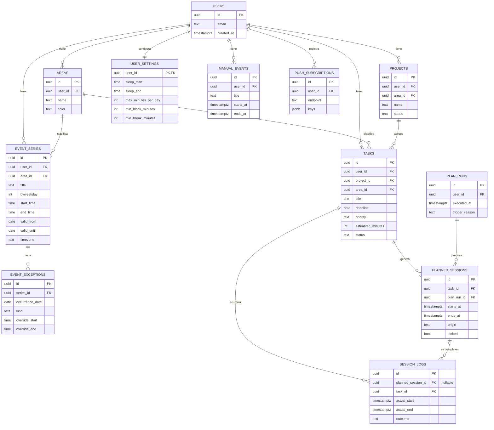

# Modelo de datos

## 1. Diagrama entidad-relación



## 2. Decisiones de modelado

### 2.1 Recurrencia con excepciones

`event_series` guarda **una fila por serie** (ej. "Cálculo I: lunes y miércoles 18:00-20:00, hasta el
2026-12-15"), no una fila por ocurrencia. Las ocurrencias concretas se **expanden en runtime** dentro
de la ventana `[from, to]` que pide cada vista o el planificador.

`event_exceptions` cubre los casos que rompen el patrón: un feriado que cancela una clase puntual
(`kind = CANCELLED`), o una clase reprogramada a otro horario (`kind = MOVED` con `override_start` /
`override_end`). Esto evita el problema clásico de "edité la serie y ahora no sé qué ocurrencias
específicas cambian" — la excepción es explícita y por fecha.

Detalle completo de la decisión en
[`decisions/0003-recurrencia-con-excepciones.md`](decisions/0003-recurrencia-con-excepciones.md).

### 2.2 Tarea → sesión planificada → sesión cumplida

Tres tablas separadas, no una:

- `tasks`: qué hay que hacer, con deadline, prioridad y estimación.
- `planned_sessions`: qué bloques de tiempo asignó el planificador (o el usuario manualmente) para
  esa tarea. `origin` distingue `AUTO` (generado por el algoritmo) de `MANUAL`. `locked = true`
  significa "el usuario confirmó este bloque, no lo muevas al reprogramar". `plan_run_id` referencia
  qué corrida del planificador la generó, para poder auditar cambios.
- `session_logs`: qué pasó en la realidad. `planned_session_id` es **nullable a propósito**: permite
  registrar trabajo real que nunca fue planificado. Sin esto, "% de sesiones cumplidas" solo contaría
  el trabajo que el algoritmo predijo, ignorando el trabajo real — una métrica de productividad
  mentirosa.

`outcome` en `session_logs`: `DONE | PARTIAL | SKIPPED`. `PARTIAL` habilita retomar la tarea sin
perder registro de lo ya avanzado (`estimated_minutes - logged_minutes` en el algoritmo del
planificador, ver [`PLAN.md`](PLAN.md#5-algoritmo-del-planificador-especificación-completa)).

## 3. DDL (Postgres / Supabase)

```sql
-- Extensiones
create extension if not exists "pgcrypto";

-- Áreas (UTP, ICPNA, trabajo, personal, ...)
create table areas (
    id uuid primary key default gen_random_uuid(),
    user_id uuid not null references auth.users(id) on delete cascade,
    name text not null,
    color text not null default '#64748b',
    created_at timestamptz not null default now()
);

create table projects (
    id uuid primary key default gen_random_uuid(),
    user_id uuid not null references auth.users(id) on delete cascade,
    area_id uuid references areas(id) on delete set null,
    name text not null,
    status text not null default 'active' check (status in ('active','archived')),
    created_at timestamptz not null default now()
);

-- Series recurrentes (clases fijas)
create table event_series (
    id uuid primary key default gen_random_uuid(),
    user_id uuid not null references auth.users(id) on delete cascade,
    area_id uuid references areas(id) on delete set null,
    title text not null,
    byweekday int[] not null,           -- 0=domingo .. 6=sábado
    start_time time not null,
    end_time time not null,
    valid_from date not null,
    valid_until date not null,
    timezone text not null default 'America/Lima',
    created_at timestamptz not null default now(),
    check (end_time > start_time),
    check (valid_until >= valid_from)
);

create table event_exceptions (
    id uuid primary key default gen_random_uuid(),
    series_id uuid not null references event_series(id) on delete cascade,
    occurrence_date date not null,
    kind text not null check (kind in ('CANCELLED','MOVED')),
    override_start time,
    override_end time,
    unique (series_id, occurrence_date)
);

-- Eventos puntuales no recurrentes
create table manual_events (
    id uuid primary key default gen_random_uuid(),
    user_id uuid not null references auth.users(id) on delete cascade,
    title text not null,
    starts_at timestamptz not null,
    ends_at timestamptz not null,
    created_at timestamptz not null default now(),
    check (ends_at > starts_at)
);

-- Tareas, exámenes, entregas
create table tasks (
    id uuid primary key default gen_random_uuid(),
    user_id uuid not null references auth.users(id) on delete cascade,
    project_id uuid references projects(id) on delete set null,
    area_id uuid references areas(id) on delete set null,
    title text not null,
    deadline date not null,
    priority text not null default 'media' check (priority in ('alta','media','baja')),
    estimated_minutes int not null check (estimated_minutes > 0),
    status text not null default 'pending' check (status in ('pending','in_progress','done')),
    created_at timestamptz not null default now()
);

-- Corridas del planificador (auditoría de reprogramaciones)
create table plan_runs (
    id uuid primary key default gen_random_uuid(),
    user_id uuid not null references auth.users(id) on delete cascade,
    executed_at timestamptz not null default now(),
    trigger_reason text not null   -- 'manual' | 'session_skipped' | 'task_created' | 'deadline_changed'
);

-- Sesiones planificadas
create table planned_sessions (
    id uuid primary key default gen_random_uuid(),
    task_id uuid not null references tasks(id) on delete cascade,
    plan_run_id uuid references plan_runs(id) on delete set null,
    starts_at timestamptz not null,
    ends_at timestamptz not null,
    origin text not null check (origin in ('AUTO','MANUAL')),
    locked boolean not null default false,
    created_at timestamptz not null default now(),
    check (ends_at > starts_at)
);

-- Registro de lo realmente cumplido
create table session_logs (
    id uuid primary key default gen_random_uuid(),
    planned_session_id uuid references planned_sessions(id) on delete set null,
    task_id uuid not null references tasks(id) on delete cascade,
    actual_start timestamptz not null,
    actual_end timestamptz,
    outcome text not null check (outcome in ('DONE','PARTIAL','SKIPPED')),
    created_at timestamptz not null default now()
);

-- Configuración por usuario
create table user_settings (
    user_id uuid primary key references auth.users(id) on delete cascade,
    sleep_start time not null default '23:00',
    sleep_end time not null default '07:00',
    max_minutes_per_day int not null default 240,
    min_block_minutes int not null default 30,
    min_break_minutes int not null default 10
);

-- Suscripciones Web Push
create table push_subscriptions (
    id uuid primary key default gen_random_uuid(),
    user_id uuid not null references auth.users(id) on delete cascade,
    endpoint text not null unique,
    keys jsonb not null,
    created_at timestamptz not null default now()
);

-- Índices
create index idx_event_series_user on event_series(user_id);
create index idx_manual_events_user_time on manual_events(user_id, starts_at);
create index idx_tasks_user_deadline on tasks(user_id, deadline);
create index idx_planned_sessions_task on planned_sessions(task_id);
create index idx_planned_sessions_time on planned_sessions(starts_at);
create index idx_session_logs_task on session_logs(task_id);

-- Row Level Security
alter table areas enable row level security;
alter table projects enable row level security;
alter table event_series enable row level security;
alter table event_exceptions enable row level security;
alter table manual_events enable row level security;
alter table tasks enable row level security;
alter table plan_runs enable row level security;
alter table planned_sessions enable row level security;
alter table session_logs enable row level security;
alter table user_settings enable row level security;
alter table push_subscriptions enable row level security;

-- Política estándar: el dueño de la fila (por user_id directo o vía join) es el único con acceso
create policy "own rows" on areas for all using (auth.uid() = user_id);
create policy "own rows" on projects for all using (auth.uid() = user_id);
create policy "own rows" on event_series for all using (auth.uid() = user_id);
create policy "own rows" on manual_events for all using (auth.uid() = user_id);
create policy "own rows" on tasks for all using (auth.uid() = user_id);
create policy "own rows" on plan_runs for all using (auth.uid() = user_id);
create policy "own rows" on user_settings for all using (auth.uid() = user_id);
create policy "own rows" on push_subscriptions for all using (auth.uid() = user_id);

create policy "own via series" on event_exceptions for all using (
    exists (select 1 from event_series s where s.id = series_id and s.user_id = auth.uid())
);
create policy "own via task" on planned_sessions for all using (
    exists (select 1 from tasks t where t.id = task_id and t.user_id = auth.uid())
);
create policy "own via task" on session_logs for all using (
    exists (select 1 from tasks t where t.id = task_id and t.user_id = auth.uid())
);
```
